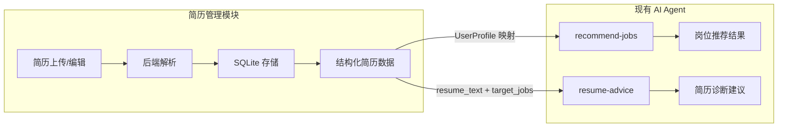
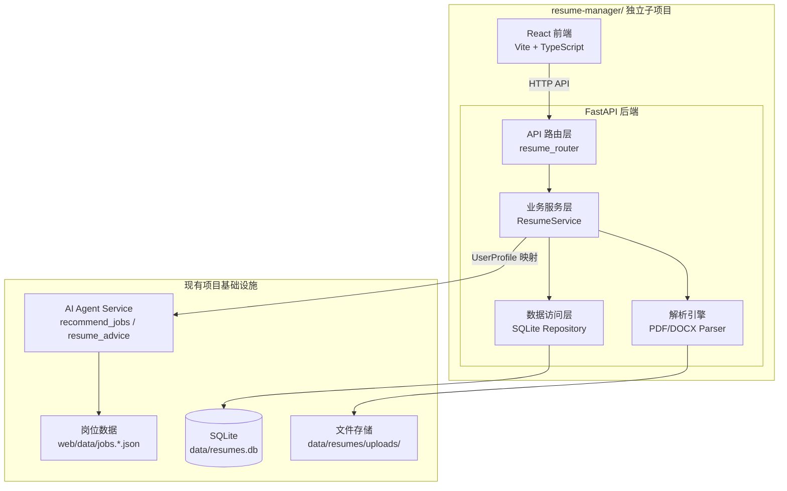

## 产品概述

简历管理模块是 job_info_collector 项目的新增功能模块，提供完整的简历全生命周期管理能力。该模块将作为独立子项目开发，后续可无缝并入主网站。核心价值在于：用户上传或在线创建简历后，系统能自动解析简历结构化信息，并与已采集的岗位数据进行智能匹配推荐和简历诊断。

## 用户需求

用户确认的四个核心目标：

1. **个人简历管理**：上传 PDF/Word 简历，自动解析为结构化数据（基本信息、教育经历、技能、项目经历等），支持在线编辑和导出
2. **简历库管理**：批量导入多份简历，支持分类标签、搜索、状态标记（草稿/已完成/已投递），类似轻量级 ATS
3. **简历+岗位匹配**：解析后的简历自动提取 UserProfile，调用现有 AI Agent 的 recommend-jobs 和 resume-advice 接口实现智能匹配和简历诊断
4. **在线编辑器创建**：除上传外，支持从零开始在线填写创建简历

## Core Features

- 简历上传（PDF + .docx），后端解析为结构化 JSON
- 在线简历编辑器（表单式，支持基本信息、教育经历、技能、项目经历、工作经历等模块）
- 简历列表管理（CRUD、搜索、筛选、标签分类、状态管理）
- 简历详情查看（解析结果结构化展示 + 原始内容预览）
- 一键匹配岗位（将简历信息转为 UserProfile，调用 /api/ai/recommend-jobs）
- 一键简历诊断（调用 /api/ai/resume-advice，展示匹配度、技能差距、优化建议）
- 简历导出（PDF/JSON 格式）
- 与现有 AI Agent 后端无缝集成

## Tech Stack Selection

### 后端

- **框架**: FastAPI（与现有 `src/ai_agent/app.py` 保持一致）
- **语言**: Python 3.14（项目已统一）
- **简历解析**: pdfplumber（PDF 文本提取）+ python-docx（Word 解析）
- **数据存储**: SQLite（轻量、无需额外服务、支持并发读写、与现有 LanceDB 互补）
- **ORM**: SQLAlchemy（可选，MVP 阶段直接用 sqlite3 也足够）
- **导出**: reportlab 或 weasyprint（PDF 导出）
- **依赖管理**: 追加到现有 `requirements.txt`

### 前端

- **框架**: Vite + React + TypeScript（独立开发，后续并入时迁移组件）
- **UI 组件库**: shadcn/ui（与 Tailwind CSS 配合，风格可定制）
- **状态管理**: React Query（服务端状态）+ Zustand（客户端状态）
- **样式**: Tailwind CSS，颜色变量对齐主网站 `--primary: #2f6df6`、`--ink: #16324f` 等设计令牌
- **图标**: Lucide React
- **文件上传**: 原生 fetch + FormData

## Implementation Approach

### 架构策略：独立子项目 → 模块集成

采用**独立子项目开发**策略，项目根目录为 `resume-manager/`，内部包含前后端完整结构。开发阶段前后端独立运行、独立调试。后续并入主网站时：

- 后端：将简历路由注册到现有 `src/ai_agent/app.py` 的 FastAPI 实例
- 前端：将 React 组件迁移为 Web Components 或直接集成到主网站视图切换中

### 关键技术决策

1. **简历解析后端化**：PDF/Word 解析需要 Python 库（pdfplumber/python-docx），无法纯前端实现，必须后端处理
2. **SQLite 存储**：简历数据需要持久化 CRUD，SQLite 零配置、文件级部署、与 GitHub Pages 静态前端互补，适合个人/小团队场景
3. **复用现有 AI Agent 能力**：简历解析后的结构化数据可直接映射为现有 `UserProfile` 模型，复用 `recommend_jobs` 和 `resume_advice` 服务，零重复开发
4. **前端独立 Vite 项目**：独立开发效率高、热更新快，后续集成时 shadcn 组件可按需迁移

### 与现有 AI Agent 的集成方式



简历解析后的结构化字段直接映射到现有 `UserProfile`（education/major/grade/skills/experience_summary 等），然后调用 `AIAgentService.recommend_jobs()` 和 `AIAgentService.resume_advice()` 方法，复用已有的检索、打分、LLM 增强全链路。

## Implementation Notes

- **向后兼容**：新增 `src/ai_agent/resume/` 模块不影响现有爬虫、分析、AI Agent 的任何代码
- **安全性**：复用现有 `ai_agent/utils/security.py` 的 sanitize 工具函数处理用户输入
- **日志**：复用现有 `logging` 模式，简历解析错误记录到控制台和 logs 目录
- **性能**：SQLite 单文件数据库读写延迟 <5ms，简历列表页支持分页（page_size=20），解析大文件（>5MB PDF）使用流式读取
- **文件存储**：上传的原始文件存入 `data/resumes/uploads/`，解析结果存入 SQLite，导出临时文件存入 `data/resumes/exports/`
- **部署**：后端启动命令 `uvicorn src.ai_agent.app:app --port 8001 --reload`，简历模块路由通过 `app.include_router` 自动挂载

## Architecture Design



## Directory Structure

```
resume-manager/                        # 独立子项目根目录
├── package.json                       # [NEW] 前端依赖与脚本
├── vite.config.ts                     # [NEW] Vite 配置，含 API 代理
├── tsconfig.json                      # [NEW] TypeScript 配置
├── tailwind.config.js                 # [NEW] Tailwind 配置，对齐主站设计令牌
├── postcss.config.js                  # [NEW] PostCSS 配置
├── index.html                         # [NEW] 前端入口 HTML
├── public/
│   └── favicon.svg                    # [NEW] 站点图标
├── src/                               # 前端源码
│   ├── main.tsx                       # [NEW] React 入口
│   ├── App.tsx                        # [NEW] 根组件，路由配置
│   ├── api/                           # [NEW] API 请求封装
│   │   ├── client.ts                  # [NEW] Axios/fetch 封装，错误处理
│   │   └── resume.ts                  # [NEW] 简历 CRUD API
│   ├── types/                         # [NEW] TypeScript 类型定义
│   │   └── resume.ts                  # [NEW] Resume, ResumeModule 等类型
│   ├── hooks/                         # [NEW] 自定义 Hooks
│   │   └── useResumes.ts              # [NEW] 简历列表数据获取与管理
│   ├── pages/                         # [NEW] 页面组件
│   │   ├── ResumeListPage.tsx         # [NEW] 简历列表页（搜索、筛选、批量操作）
│   │   ├── ResumeEditPage.tsx         # [NEW] 简历编辑/创建页（表单编辑器）
│   │   ├── ResumeDetailPage.tsx       # [NEW] 简历详情页（解析结果 + 原始预览）
│   │   └── MatchResultPage.tsx        # [NEW] 岗位匹配结果页
│   ├── components/                    # [NEW] 可复用组件
│   │   ├── ResumeCard.tsx             # [NEW] 简历卡片组件
│   │   ├── UploadZone.tsx             # [NEW] 文件拖拽上传区域
│   │   ├── ResumeForm.tsx             # [NEW] 简历表单（基本信息/教育/技能/经历）
│   │   ├── MatchScoreBadge.tsx        # [NEW] 匹配度评分徽标
│   │   └── DiagnosisPanel.tsx         # [NEW] 简历诊断面板
│   ├── lib/                           # [NEW] 工具库
│   │   └── utils.ts                   # [NEW] 通用工具函数
│   └── styles/                        # [NEW] 样式文件
│       └── globals.css                # [NEW] 全局样式 + Tailwind 导入 + CSS 变量
│
src/ai_agent/resume/                   # [NEW] 后端简历模块（集成到现有 AI Agent）
│   ├── __init__.py                    # [NEW] 模块初始化
│   ├── router.py                      # [NEW] 简历 API 路由（/api/resume/*）
│   ├── schemas.py                     # [NEW] Pydantic 请求/响应模型
│   ├── service.py                     # [NEW] 简历业务逻辑（CRUD、解析编排）
│   ├── parser/                        # [NEW] 简历解析引擎
│   │   ├── __init__.py                # [NEW]
│   │   ├── base.py                    # [NEW] 解析器基类/接口定义
│   │   ├── pdf_parser.py              # [NEW] PDF 解析（pdfplumber）
│   │   ├── docx_parser.py             # [NEW] Word 解析（python-docx）
│   │   └── extractor.py               # [NEW] 结构化信息提取（正则/规则）
│   ├── repository.py                  # [NEW] SQLite 数据访问层
│   └── exporter.py                    # [NEW] 简历导出（PDF/JSON）
│
data/resumes/                          # [NEW] 简历数据存储目录
│   ├── uploads/                       # [NEW] 上传原始文件
│   └── exports/                       # [NEW] 导出临时文件
│
docs/                                  # [NEW] 文档
│   └── RESUME_MODULE_PRD.md           # [NEW] 简历模块产品需求文档
```

## Key Code Structures

### 后端核心数据模型 (src/ai_agent/resume/schemas.py)

```python
class ResumeCreate(BaseModel):
    """上传创建简历请求"""
    filename: str                          # 原始文件名
    file_type: Literal["pdf", "docx"]      # 文件类型

class ResumeProfile(BaseModel):
    """简历解析后的结构化信息（可映射为 UserProfile）"""
    name: str = ""
    phone: str = ""
    email: str = ""
    education: str = ""                    # 学历
    major: str = ""                        # 专业
    grade: str = ""                        # 年级
    skills: list[str] = []                 # 技能列表
    experience_summary: str = ""           # 经历概要
    city_preferences: list[str] = []       # 城市偏好
    projects: list[ResumeProject] = []     # 项目经历
    raw_text: str = ""                     # 原始提取文本

class ResumeItem(BaseModel):
    """简历列表项（列表查询返回）"""
    id: str
    filename: str
    file_type: str
    profile: ResumeProfile
    status: Literal["draft", "completed", "submitted"] = "draft"
    tags: list[str] = []
    created_at: str
    updated_at: str
```

### 前端核心类型 (resume-manager/src/types/resume.ts)

```typescript
interface Resume {
  id: string;
  filename: string;
  fileType: "pdf" | "docx" | "manual";
  profile: ResumeProfile;
  status: "draft" | "completed" | "submitted";
  tags: string[];
  createdAt: string;
  updatedAt: string;
}

interface MatchResult {
  jobs: JobCard[];           // 复用现有 AI Agent JobCard 类型
  diagnosis: ResumeDiagnosis; // 优势/差距/缺失关键词
  suggestions: ResumeSuggestions;
}
```

## 设计风格

采用**现代简洁专业风**，与主站 Campus Job Navigator 的设计语言保持一致。主站使用柔和蓝色渐变（`#f4f8ff` 背景、`#2f6df6` 主色）和白色毛玻璃卡片，简历管理模块延续这一视觉体系。

## 页面规划（5个核心页面）

### 页面1: 简历列表页 (ResumeListPage)

- **顶部导航栏**: 左侧"Campus Job Navigator"品牌标识 + 返回主站链接，右侧"AI 助手"入口
- **操作工具栏**: 搜索输入框（按姓名/标签搜索）+ 状态筛选下拉（全部/草稿/已完成/已投递）+ "上传简历"按钮 + "新建简历"按钮
- **简历卡片网格**: 两列/三列自适应网格布局，每张卡片展示文件名、状态标签、创建时间、技能标签摘要、操作按钮（查看/编辑/删除/匹配岗位）
- **空状态提示**: 无简历时展示引导插图和"上传第一份简历"CTA

### 页面2: 简历上传/创建页 (ResumeEditPage - 创建模式)

- **双入口切换**: 顶部 Tab 切换"上传文件"和"在线创建"
- **上传区域**: 大型虚线拖拽区域，支持点击选择，展示上传进度和解析状态动画
- **在线表单**: 左右两栏布局，左侧基本信息（姓名、手机、邮箱、学历、专业、年级），右侧技能标签输入 + 城市偏好多选
- **经历编辑区**: 下方可动态增删的项目经历/工作经历卡片，每张卡片含时间段、公司/组织、角色、描述

### 页面3: 简历详情页 (ResumeDetailPage)

- **信息头部**: 姓名大标题 + 状态标签 + 标签列表 + 操作按钮（编辑/导出/匹配岗位/删除）
- **结构化信息面板**: 卡片式布局，分别展示基本信息、教育背景、技能标签云、项目经历时间线
- **原始内容预览**: 可折叠区域，展示从 PDF/Word 提取的原始文本
- **AI 分析侧边栏**: 右侧固定面板，展示岗位匹配结果和简历诊断建议

### 页面4: 岗位匹配结果页 (MatchResultPage)

- **匹配概览**: 顶部显示匹配岗位数量、平均匹配度、技能覆盖率进度条
- **推荐岗位列表**: 按匹配度排序的岗位卡片，每张卡片含公司、岗位名、城市、匹配度徽标、匹配原因标签
- **简历诊断面板**: 优势列表（绿色）、差距列表（橙色）、缺失关键词（红色标签）、优化建议（优先级分级 P0/P1/P2）
- **操作按钮**: "筛选结果"、"导出报告"、"返回简历"

### 页面5: 简历编辑页 (ResumeEditPage - 编辑模式)

- **与创建页共享布局**: 复用页面2的表单组件
- **预填充数据**: 从解析结果或已有数据预填充所有字段
- **差异对比**: 编辑保存时可选择是否覆盖 AI 解析结果
- **实时预览**: 右侧实时预览简历渲染效果

## 交互设计要点

- 文件上传使用拖拽区域，上传后显示解析进度动画（旋转图标 + "正在解析..."）
- 卡片悬浮时有轻微上浮阴影效果，操作按钮渐显
- 匹配度使用渐变色圆环进度条（红→黄→绿）
- 诊断面板使用颜色编码的标签和图标增强可读性
- 状态变更使用 Toast 通知，无 alert 弹窗

## Agent Extensions

### Skill: writing-plans

- **Purpose**: 在生成详细实施方案时使用，确保计划结构化、可执行
- **Expected outcome**: 产出包含文件级任务拆分的详细开发计划

### Skill: frontend-design

- **Purpose**: 开发前端页面时生成高质量的 UI 代码，确保与主站设计风格一致
- **Expected outcome**: 产出精美、响应式的 React 组件代码

### SubAgent: code-explorer

- **Purpose**: 在开发过程中需要搜索项目代码、理解现有模式时使用
- **Expected outcome**: 快速定位现有代码中的可复用模式和接口定义