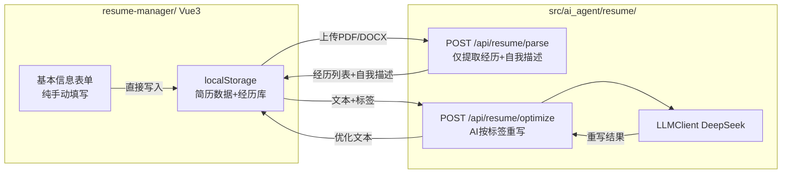

## 产品概述

简历管理模块是 job_info_collector 项目的新增功能，提供简历全生命周期管理：上传解析、在线编辑、模块拼接保存、AI 优化、多模板导出 PDF。作为独立子项目开发，后续可并入主网站。

## Core Features

### 简历三大模块结构

- **基本信息模块**（纯手动填写，不解析）：姓名、联系方式、学历、专业、年级、学业成绩、相关课程、技能与掌握程度、获奖与比赛
- **经历与项目模块**（从 PDF/Word 解析提取）：项目经历、实习经历、工作经历。支持跨简历深拷贝复用，共享项目经历库
- **自我描述模块**（从 PDF/Word 解析提取）：自我评价、求职意向、个人总结

### 核心交互

- PDF/Word 上传后端解析，**仅解析经历与项目 + 自我描述**两大模块的结构化数据
- 基本信息由用户通过在线表单手动填写
- **模块拼接**：用户自由组合三大模块，保存至"我的简历"
- **项目经历库**：所有已保存简历的项目经历汇聚为共享库，支持深拷贝新建
- **AI 能力**（复用 DeepSeek）：解析兜底（模块拆分失败时 AI 辅助）；按特定标签对项目和自我描述进行 AI 优化重写
- **多模板 PDF 导出**：校园手绘风模板、简洁表格模板等，前端 html2canvas + jsPDF 生成

### 数据存储

- 全部数据保存在 **localStorage**（后端无持久化）
- 后端仅提供两个 API：文件解析（PDF/DOCX 提取经历+自我描述）和 AI 优化重写

## Tech Stack Selection

### 前端

- **框架**: Vue 3 + TypeScript（Vite 构建）
- **状态管理**: Pinia（localStorage 读写封装）
- **路由**: Vue Router 4
- **样式**: Tailwind CSS（校园手绘风）
- **PDF 导出**: html2canvas + jsPDF（前端生成，多模板切换）
- **图标**: lucide-vue-next

### 后端（仅解析 + AI，挂载到现有 AI Agent）

- **框架**: FastAPI（注册到现有 `src/ai_agent/app.py`）
- **PDF 文本提取**: pdfplumber
- **DOCX 文本提取**: python-docx
- **AI**: 复用现有 `LLMClient`（DeepSeek，`src/ai_agent/utils/llm_client.py`）
- **安全**: 复用 `sanitize_text`（`src/ai_agent/utils/security.py`）
- **新依赖**: pdfplumber, python-docx 追加到 requirements.txt

## Implementation Approach

### 架构策略：前端为主、后端为辅

1. **前端承担全部数据管理**：所有简历 CRUD、模块拼接、项目经历库均在 localStorage 中管理
2. **后端仅提供两个 API**：

- `POST /api/resume/parse` — 上传 PDF/DOCX，提取经历与项目 + 自我描述（基本信息不解析）
- `POST /api/resume/optimize` — AI 按标签重写项目描述或自我描述

3. **复用现有基础设施**：

- `LLMClient.chat()` 做 AI 调用（已封装 DeepSeek 请求、错误处理、超时）
- `sanitize_text()` 做输入清洗
- `ModelConfig` 复用 DeepSeek 配置

### 关键技术决策

1. **解析聚焦化**：后端仅提取"经历与项目"和"自我描述"两个模块，按中文简历常见标题（项目经历、实习经历、工作经历、自我评价、求职意向、个人总结）用正则拆分，失败时调用 DeepSeek AI 兜底
2. **基本信息不解析**：基本信息完全由前端表单手动填写，减少解析复杂度，提高数据准确度
3. **PDF 导出前端化**：html2canvas 将模板 DOM 渲染为 canvas，jsPDF 转为 PDF；多模板通过切换不同 Vue 组件/CSS class 实现
4. **深拷贝项目经历**：前端 `JSON.parse(JSON.stringify())` 深拷贝，从 localStorage 的项目经历库中选取并复制到当前编辑简历，每次深拷贝生成新 UUID

### 与现有 AI Agent 的集成



后端新增路由通过 `app.include_router(resume_router)` 挂载到 `src/ai_agent/app.py`。

## Implementation Notes

- **向后兼容**：新增 `src/ai_agent/resume/` 不影响现有爬虫、分析、AI Agent 代码
- **安全性**：复用 `sanitize_text()` 清洗用户输入到 AI 的文本，防止 prompt injection
- **性能**：PDF 文本提取后端处理；AI 优化 25s 超时（LLMClient 已内置）；localStorage 约 5MB 限制足够存储数百份简历结构化数据
- **localStorage 容量管理**：封装 `localStorage.ts` 工具，存入前检查剩余容量，接近上限时提示用户清理
- **部署**：后端启动命令不变（`uvicorn src.ai_agent.app:app --port 8001 --reload`），简历路由自动挂载；前端 `npm run dev` 独立运行在 5173

## Directory Structure

```
resume-manager/                         # [NEW] Vue3 前端独立子项目
├── package.json                        # [NEW] vue3, vue-router, pinia, tailwindcss, jspdf, html2canvas
├── vite.config.ts                      # [NEW] Vite 配置，API 代理到 localhost:8001
├── tsconfig.json                       # [NEW]
├── tsconfig.app.json                   # [NEW] verbatimModuleSyntax: false
├── tailwind.config.js                  # [NEW] Tailwind 配置，校园手绘风扩展
├── postcss.config.js                   # [NEW]
├── index.html                          # [NEW] 入口 HTML
├── public/
│   └── favicon.svg                     # [NEW]
├── src/
│   ├── main.ts                         # [NEW] Vue 入口，注册 Pinia/Router
│   ├── App.vue                         # [NEW] 根组件 + 路由视图
│   ├── router/index.ts                 # [NEW] 路由配置（列表/编辑/详情/经历库/导出）
│   ├── stores/
│   │   └── resumeStore.ts              # [NEW] Pinia store，全部 CRUD 基于 localStorage
│   ├── types/
│   │   └── resume.ts                   # [NEW] 三大模块 TypeScript 类型定义
│   ├── api/
│   │   └── resume.ts                   # [NEW] 后端 API 调用（parse, optimize）
│   ├── composables/
│   │   ├── useResumeEditor.ts          # [NEW] 简历编辑逻辑（表单状态、保存、模块拼接）
│   │   └── useProjectLibrary.ts        # [NEW] 项目经历库聚合 + 深拷贝
│   ├── views/
│   │   ├── ResumeListView.vue          # [NEW] 我的简历列表页
│   │   ├── ResumeEditView.vue          # [NEW] 简历编辑页（创建+编辑+上传解析）
│   │   ├── ResumeDetailView.vue        # [NEW] 简历详情预览页
│   │   ├── ProjectLibraryView.vue      # [NEW] 项目经历库浏览页
│   │   └── ExportPreviewView.vue       # [NEW] PDF 导出预览（多模板切换）
│   ├── components/
│   │   ├── ModuleCard.vue              # [NEW] 模块卡片外壳（手绘风便签样式）
│   │   ├── BasicInfoForm.vue           # [NEW] 基本信息表单（含成绩/课程/技能掌握度/获奖）
│   │   ├── ExperienceForm.vue          # [NEW] 经历与项目表单（动态增删条目）
│   │   ├── SelfDescriptionForm.vue     # [NEW] 自我描述表单
│   │   ├── ModuleAssembler.vue         # [NEW] 模块拼接面板（勾选启用/禁用模块）
│   │   ├── ProjectSelector.vue         # [NEW] 项目经历选择器（从经历库深拷贝）
│   │   ├── UploadZone.vue              # [NEW] 文件拖拽上传区域
│   │   ├── AiOptimizeButton.vue        # [NEW] AI 优化按钮 + 标签选择弹窗
│   │   ├── ExportTemplate.vue          # [NEW] PDF 导出模板容器
│   │   └── HanddrawnTemplate.vue       # [NEW] 校园手绘风导出模板
│   ├── utils/
│   │   ├── localStorage.ts             # [NEW] localStorage 封装（容量检查/序列化）
│   │   ├── deepCopy.ts                 # [NEW] 深拷贝工具 + UUID 生成
│   │   └── pdfExport.ts                # [NEW] html2canvas + jsPDF 导出封装
│   ├── styles/
│   │   ├── main.css                    # [NEW] Tailwind 入口 + CSS 变量 + 全局样式
│   │   └── handdrawn.css               # [NEW] 校园手绘风专用样式（纸张纹理/便签/胶带）
│   └── assets/
│       └── handdrawn/                  # [NEW] 手绘风 SVG 装饰素材

src/ai_agent/resume/                    # [NEW] 后端简历模块
├── __init__.py                         # [NEW] 模块初始化
├── router.py                           # [NEW] POST /api/resume/parse, POST /api/resume/optimize
├── schemas.py                          # [NEW] ParseRequest/Response, OptimizeRequest/Response
├── parser/
│   ├── __init__.py                     # [NEW] 统一解析入口
│   ├── base.py                         # [NEW] 解析器基类（文本提取接口）
│   ├── pdf_parser.py                   # [NEW] PDF 文本提取（pdfplumber）
│   ├── docx_parser.py                  # [NEW] DOCX 文本提取（python-docx）
│   ├── splitter.py                     # [NEW] 中文简历模块拆分器（正则按标题分段，仅经历+自我描述）
│   └── extractor.py                    # [NEW] 结构化字段提取（时间段/公司/角色/描述）
└── optimizer.py                        # [NEW] AI 优化重写（调用 LLMClient，按标签生成 prompt）

src/ai_agent/app.py                     # [MODIFY] 新增 app.include_router(resume_router)
requirements.txt                        # [MODIFY] 追加 pdfplumber, python-docx
docs/
└── RESUME_MODULE_PRD.md                # [NEW] 简历模块产品需求文档
```

## Key Code Structures

### 后端请求/响应模型 (src/ai_agent/resume/schemas.py)

```python
class ParseRequest(BaseModel):
    file_type: Literal["pdf", "docx"]   # 文件类型

class ExperienceItem(BaseModel):
    type: str = ""                      # project / internship / work
    title: str = ""
    organization: str = ""
    role: str = ""
    start_date: str = ""
    end_date: str = ""
    description: str = ""
    tech_stack: list[str] = []

class SelfDescription(BaseModel):
    self_evaluation: str = ""           # 自我评价
    career_objective: str = ""          # 求职意向
    personal_summary: str = ""          # 个人总结

class ParseResponse(BaseModel):
    success: bool
    raw_text: str = ""
    experiences: list[ExperienceItem] = []  # 仅经历与项目
    self_description: SelfDescription = Field(default_factory=SelfDescription)
    parse_method: Literal["rule", "ai_fallback"] = "rule"
    warnings: list[str] = []

class OptimizeRequest(BaseModel):
    text: str                           # 待优化文本（项目描述/自我描述）
    tags: list[str]                     # 优化标签（star/quantify/tech_align/concise 等）
    context: str = ""                   # 上下文补充

class OptimizeResponse(BaseModel):
    optimized_text: str
    tags_used: list[str]
```

### 前端核心类型 (resume-manager/src/types/resume.ts)

```typescript
interface BasicInfo {
  name: string; phone: string; email: string;
  education: string; major: string; grade: string;
  academicScore: string;               // 学业成绩/GPA
  relevantCourses: string[];           // 相关课程
  skills: SkillItem[];                 // 技能与掌握程度
  awards: AwardItem[];                 // 获奖与比赛
}

interface SkillItem { name: string; level: "了解" | "熟悉" | "掌握" | "精通" }
interface AwardItem { name: string; level: string; date: string; description: string }

interface ExperienceItem {
  id: string;                          // UUID，用于深拷贝追踪
  type: "project" | "internship" | "work";
  title: string; organization: string; role: string;
  startDate: string; endDate: string;
  description: string;                 // 支持 AI 优化重写
  techStack: string[];
}

interface SelfDescription {
  selfEvaluation: string;              // 支持 AI 优化重写
  careerObjective: string;
  personalSummary: string;             // 支持 AI 优化重写
}

interface Resume {
  id: string;
  name: string;                        // 简历标题（用户自定义）
  basicInfo: BasicInfo;                // 纯手动填写
  experiences: ExperienceItem[];       // 解析提取或手动添加
  selfDescription: SelfDescription;    // 解析提取或手动填写
  modules: { basicInfo: boolean; experience: boolean; selfDescription: boolean }; // 模块拼接开关
  createdAt: string; updatedAt: string;
}
```

## 设计风格：校园手绘风 (Campus Hand-drawn Style)

### 视觉特征

- **纸张质感**: 米白色背景 `#FFF8F0`，搭配轻微纸张纹理噪点
- **手绘边框**: SVG 实现的波浪线、不规则虚线边框、手绘箭头装饰
- **彩色便签**: 不同模块使用淡彩色便签卡片——基本信息淡黄 `#FFF9C4`、经历与项目淡绿 `#E8F5E9`、自我描述淡蓝 `#E3F2FD`
- **胶带装饰**: 模块卡片角落使用半透明"胶带"效果固定
- **活页夹效果**: 顶部导航模拟笔记本活页环
- **手写字体**: 标题使用 `ZCOOL XiaoWei`，正文使用 `Noto Sans SC` 回退 `PingFang SC`
- **铅笔涂鸦**: 页面边角使用铅笔线条装饰、小涂鸦图标

### 交互风格

- 卡片悬浮时轻微倾斜旋转（2-3度），阴影加深
- 按钮按下时模拟手按纸面效果（scale 0.97 + 阴影变化）
- AI 优化加载时显示铅笔写字动画
- 模块拼接使用便利贴勾选风格
- Toast 通知采用便利贴弹出样式
- 表单聚焦时输入框边框变为手绘高亮色

### 页面规划（5个核心页面）

### 页面1: 我的简历列表页 (ResumeListView)

- **活页导航栏**: 顶部笔记本活页环效果，左侧品牌名，右侧"项目经历库"入口
- **操作区**: 搜索框 + "上传简历解析"按钮 + "新建简历"按钮
- **简历卡片网格**: 便签卡片布局，展示简历名称、模块完成状态指示器（三色圆点）、更新时间、操作按钮（编辑/详情/导出/删除）
- **空状态**: 手绘插图引导"创建你的第一份简历"

### 页面2: 简历编辑页 (ResumeEditView)

- **模块拼接面板**: 顶部三个模块开关卡片（基本信息/经历与项目/自我描述），勾选启用
- **基本信息区**: 淡黄便签卡片，表单含姓名/联系方式/学历/专业/年级/学业成绩输入 + 相关课程标签 + 技能掌握度滑块/下拉 + 获奖比赛动态列表
- **经历与项目区**: 淡绿便签卡片，"从经历库导入"按钮 + 手动添加条目，每条经历含时间段/组织/角色/描述/技术栈，支持 AI 优化按钮
- **自我描述区**: 淡蓝便签卡片，三个文本域（自我评价/求职意向/个人总结），每段支持 AI 优化按钮
- **底部操作栏**: 固定底部，"保存"按钮 + "预览"按钮

### 页面3: 简历详情页 (ResumeDetailView)

- **模拟纸张预览**: A4 比例纸张容器，展示拼接后的简历效果
- **模块分区展示**: 按启用模块渲染为连续的简历内容
- **操作工具栏**: "编辑" / "导出PDF" / "匹配岗位"按钮

### 页面4: 项目经历库页 (ProjectLibraryView)

- **全局搜索**: 按项目名/技术栈/组织搜索
- **经历卡片列表**: 所有简历的项目经历聚合展示，每张卡片含来源简历名、类型标签
- **操作**: "复制到当前简历"按钮（深拷贝）

### 页面5: 导出预览页 (ExportPreviewView)

- **模板切换栏**: 顶部缩略图切换（校园手绘风 / 简洁表格 / 极简黑白）
- **实时预览区**: 当前选中模板的完整渲染效果
- **操作栏**: "下载PDF"按钮 + "更换模板"下拉

## Agent Extensions

### Skill: frontend-design

- **Purpose**: 开发 Vue3 校园手绘风前端页面时使用，生成高质量 UI 代码
- **Expected outcome**: 产出符合校园手绘风设计规范（便签卡片、手绘边框、纸张质感）的精美 Vue3 组件

### Skill: brainstorming

- **Purpose**: 在实现复杂交互（模块拼接面板、项目经历深拷贝流程、AI 优化标签系统）前进行设计探索
- **Expected outcome**: 明确交互流程和边界情况，减少实现返工

### SubAgent: code-explorer

- **Purpose**: 开发过程中搜索现有 AI Agent 代码中的可复用模块（LLMClient 接口、sanitize 用法、路由注册方式）
- **Expected outcome**: 快速定位可复用的工具函数，确保与现有代码风格一致